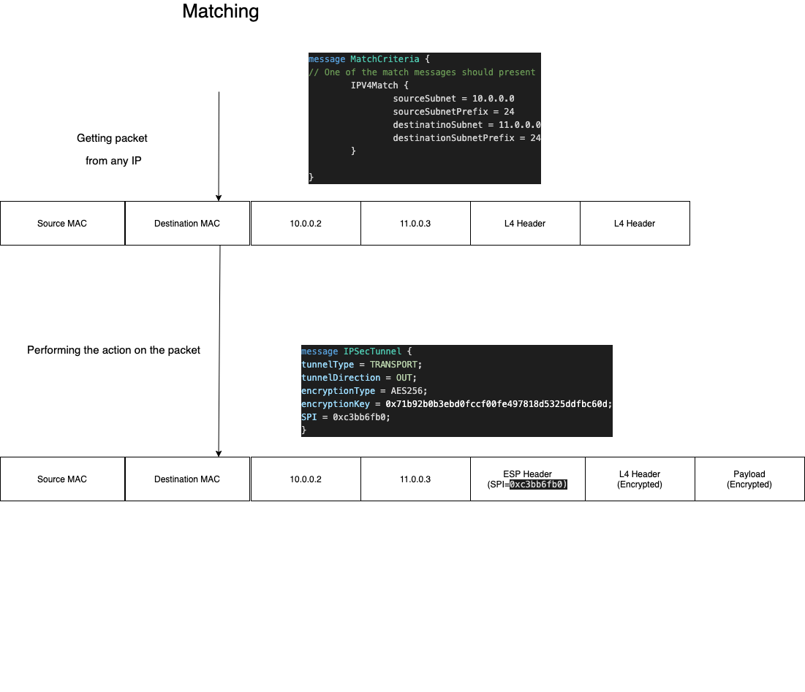
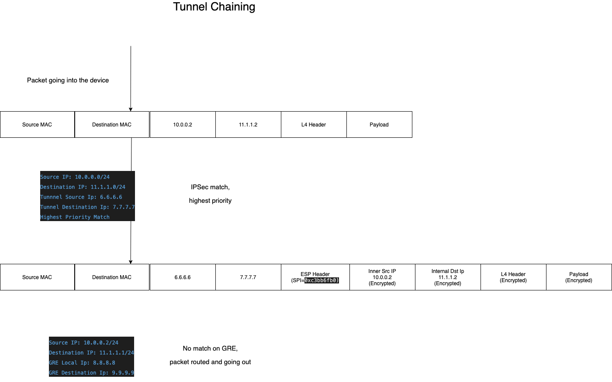
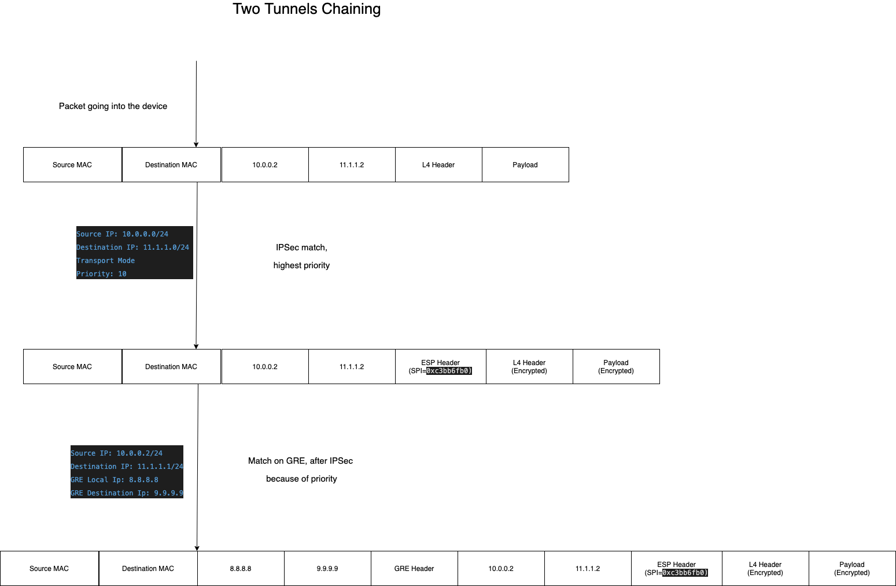

# IP Tunnel Offload

-------- DRAFT -----------

With openOffload it will be possible to offload also IP Tunnels into the underlying hardware.

A service called `ipTunnelTable` will be introduced, for CRUD operations on the offloaded sessions.

Through this service it will be possible to offload several kinds of IP Tunnels, where the common configuation between them is the `match` criteria, which indicates which IP will be used for tunnel creation / termination.

## Matching Criteria

Since IP tunnels are L3 tunnels, the only matching criteria will be source subnet & destination subnets.

```
message MatchCriteria {
    // In case it's not present, untagged traffic will be matched
    string ingress_interface = 1; // Optional field, in which interface this tunnel will be encapsulated

    // In this case VXLAN packet received will be encapsulated, only with this particular VNI
    uint32 vxlan_vni = 3;
    // In this case Geneve packet received will be matched
    uint32 geneve_vni = 4;
  
    // One of the match messages should present
    oneof ip_match {
      IPV4Match ipv4Match = 4;
      IPV6Match ipv6Match = 5;
    }
}
```

For example:



## Tunnel Chaining

This section will provide information regards tunenl chaining, or "IP in IP". Where packet should be encapsulated / decapsulated from several tunnels.

While the offloading device will handle packets, it will inspect the traffic on every "cycle" and will determine if any action should happen on the packet.

For the encapsulation part, it will look if the outer IP of the packet is check if any action can be applied to the device,
in the decapsulation part, it will look in the protocol of the packet (e.g. IPSec / GRE) and check if any decapsulation can happen on the packet, according to the offloaded tunnels.


For example, we can provide two tunnels withis parameters:

<u>IPSec Transport Mode:</u>

```
Source IP: 10.0.0.2/24
Destination IP: 11.1.1.1/24 
Tunnnel Source Ip: 6.6.6.6
Tunnel Destination Ip: 7.7.7.7
```

<u>GRE Tunnel:</u>

```
Source IP: 6.6.6.6/24
Destination IP: 7.7.7.0/24
GRE Local Ip: 8.8.8.8
GRE Destination Ip: 9.9.9.9
```

In this case, the chaining is self-explanatory.

While getting "raw" packet, the IPSec will be first (encryption) and GRE will be afterwards.

While getting "gre" packet, the GRE will be first (decapsulation) and IPSec will be afterwards.

*Note that with this kind of selection, choosing between GRE-over-IPSec / IPSec-over-GRE is easy available*


### Tunnel chaining with same match

The question arrise is, what will happen in a case where we're having tunnel with the same match?

Conside this option

<u>IPSec Transport Mode:</u>

```
Source IP: 10.0.0.0/24
Destination IP: 11.1.1.0/24 
Tunnnel Source Ip: 6.6.6.6
Tunnel Destination Ip: 7.7.7.7
```

<u>GRE Tunnel:</u>

```
Source IP: 10.0.0.2/24
Destination IP: 11.1.1.1/24
GRE Local Ip: 8.8.8.8
GRE Destination Ip: 9.9.9.9
```

What will happen to the packet? Will it be GRE encapsulated / IPSec encapsultaed?

For such cases, `priority` field introduced into the tunnel creation, the tunnel with the "highest" priority will be the chosen one.

```
message ipTunnel { 
	.....
	
  uint64 priority = 3; // Priority of the tunnel
                      
	....
}
```

In the case the priority of IPSec is higher, IPSec will be chosen, and vice versa.

**Note that in a case where only one tunnel will be used** since after the first tunnel is matched the packet is altered, and not matching the second tunnel anymore.

Let's have a look where the IPSec tunnel priority is higher than the GRE:




#### Tunnel chaining with same match - two tunnels chaining

Let's look on the following case

<u>IPSec Transport Mode:</u>

```
Source IP: 10.0.0.0/24
Destination IP: 11.1.1.0/24 
Transport Mode
Priority: 10
```

<u>GRE Tunnel:</u>

```
Source IP: 10.0.0.2/24
Destination IP: 11.1.1.1/24
GRE Local Ip: 8.8.8.8
GRE Destination Ip: 9.9.9.9
Priority: 5
```

In this case we're having a dillema which traffic will match, the highest prioity (IPSec) is the one that will be offloaded - but since the IPSec isn't changing the ip (Transport Mode), the GRE will be matched as well




## Capabilities

Capabilities are needed so the user can detect which features are available with tunnel offload,
user can detect which features are available with tunnel offload, both the tunnel capabilities & matching capabilities of the devic

That's the response the user will get in order to know which capabilities available for it:

```
message CapabilityResponse {
  // We'll have capability for matching, and for every tunnel

  message MatchCapabilities {
    bool ingressInterfaceMatching = 1; // Is interface can be matched for encapsulation / decapsulation
    bool vxlanMatching = 2; // Match with VXLAN VNI
    bool geneveMatching = 3; // Match with geneve can happen
    bool vrfMatching = 4; // Is vrf matching possible
  }

  MatchCapabilities matchCapabilities = 1;
  
  message IPSecCapabilities {
    repeated IPSecTunnelType tunnelTypeSupported = 1;
    repeated AUTH_TYPE authSupported = 2;
    repeated ENC_TYPE encryptionSupported = 3;
  }
  
  IPSecCapabilities ipsecCapabilities = 2;
  
}
```


## Open Points

- What will happen in a case where two tunnels will be downloaded with the same match and with the same priority?
- What will happen in a case interface will be deleted / vrf will be deleted?
- What will happen if some tunnel will be downloaded with unsupported capabilities?
- Should be define error number / error strings in order to "tell" what's the error occured?

