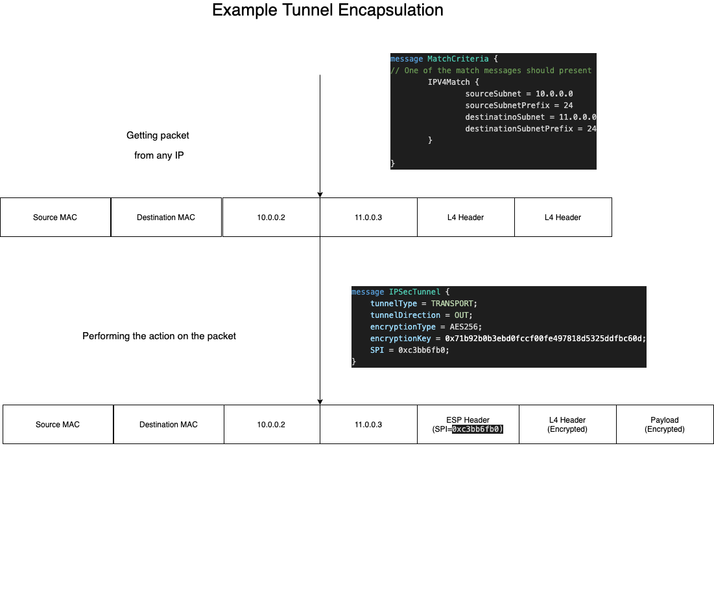
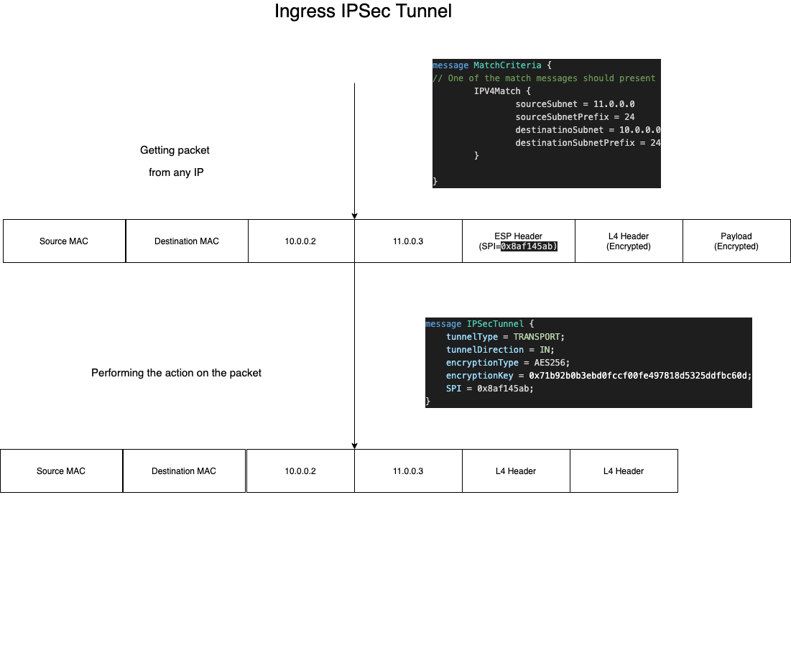
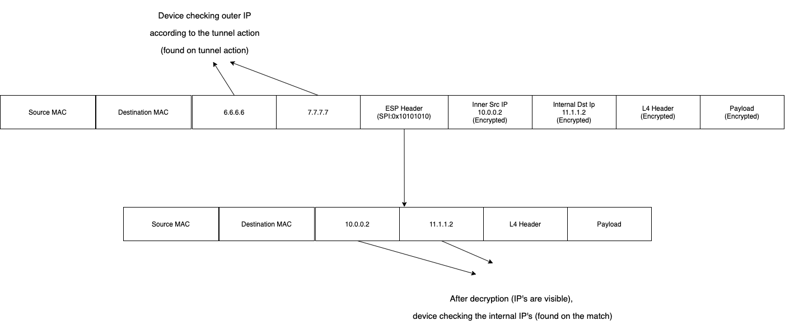
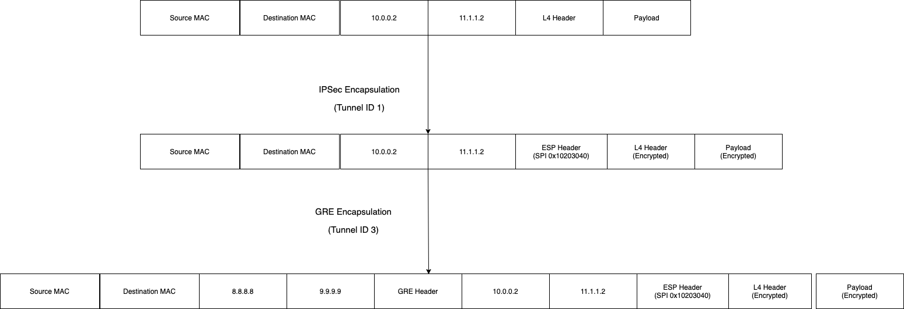
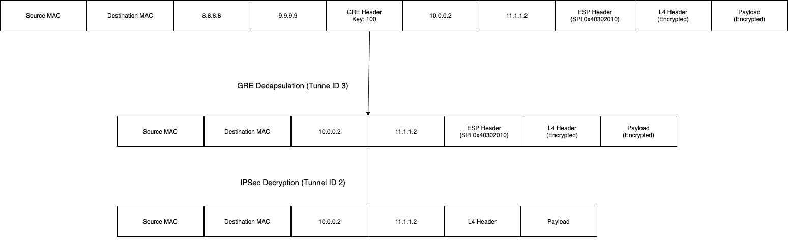

# IP Tunnel Offload

-------- DRAFT -----------

With openOffload it will be possible to offload also IP Tunnels into the underlying hardware.

A service called `ipTunnelTable` will be introduced, for CRUD operations on the offloaded sessions.

Through this service it will be possible to offload several kinds of IP Tunnels, where the common configuation between them is the `match` criteria, which indicates which packets will be matched and go to a tunnel.

## Packet Tunneling 

With openOffload, user can request to match packet encapsulate it on a tunnel, this will be done by providing matching criteria + tunnel properties.

```
message ipTunnel { // Can be   GRE / NVGRE / IPSec (SPI) / mGRE 

  MatchCriteria match_criteria = 1; // When hitting this match, 

  Action action = 2; // What we'll do after matching the packet, shuold we 
                     // keep process it or we'll just forward it 
  oneof tunnel { 
      IPSecTunnel ipsecTunnel = 3;  // Tunnel that will be used for encapsulation, can be both 
  };

}
```

*1. ipTunnel message is part of the ip tunneling service*

#### Packet Matching

Matching of packet can be based on several criteria:

- Ingress Interface
- IP's
- VRF
- Encapsulating Protocol (e.g. VXLan, IPSec, etc)

Matching of the packet is **exact**, meaning that in order to packet to be tunneled, it should be exactly matched. 

For example, if the following message will be entered to the device:


If a tunnel will be offloaded with following match criteria:

```
Match:
Source Subnet: 1.2.3.0/24
Destiantion Subnet: 5.5.5.0/24
```

The packet will **not be matched**, since the matching criteria is not including the packet VNI.

Buf if the match criteria will be this one:

```
Match:
Source Subnet: 1.2.3.0/24
Destiantion Subnet: 5.5.5.0/24
VXLAN VNI: 466
```

The packet **will be matched**, since matching criteira indicating that the packet is VXLan packet, with specific VNI (466) that's matched in the packet

#### Packet Encapsulation / Decapsulation

After packet matched, it should be encapsulated / decapsulated according to the offloaded tunnel.

The tunnels are Layer-3 tunnels, and currently only includes IPSec Offloading.

#### Example - Offloading IPsec Tunnel

In the following example, IPSec tunnel is offloaded into the device. 

IPSec is a special example where two offloads should be performed to the device, one for egress and one for ingress - since there's different SA (Security Association) per direction.

**Tunnel Creation**

For egress flow, the following example can is offloaded into the device



**Tunnel Termination**

For egress flow, the following example can is offloaded into the device



#### Matching on tunnel parameters

While tunnel is terminated, the match will be based on **both** the "Match Criteria" and the "Tunnel Parameters".

For example, while offloading GRE with these attributes:

```
Match:
Source Subnet: 10.0.0.0/24
Destination Subnet: 11.1.1.0/24

Action:
IPSec Tunne Mode
SPI: 0x10101010
Type: Decryption
Local IP: 7.7.7.7
Remote IP: 6.6.6.6

```

Since this IPSec tunnel is decrypting the packet, and get the packet already encapsulated, the offload device shuold match on the outer IP.

In this case, the device will match on outer IP source is "6.6.6.6", and destination is "7.7.7.7".

Also, the offloaded device will check that the internal IP's (after decryption) are matching the match on the packet. 



### Tunnel Chaining

This section will provide information regards tunenl chaining, or "IP in IP". Where packet should be encapsulated / decapsulated from several tunnels.

In general, tunnel chaining is available since the packet match is exact.

After the first match of packet (that will yield to encapsulation), a lookup on packet will be happen again (with the new header introduced to it) - that can cause tunnel chaining.

Assuming severeal tunnels offloaded, 

Refer to this example:

```
----
Tunnel ID 1:
----
Match:
Source Subnet: 10.0.0.0/24
Destination Subnet: 11.1.1.0/24

Action:
IPSec Transport Mode
SPI: 0x10203040
Type: Encryption


```

```
----
Tunnel ID 2:
----
Match:
Source Subnet: 11.1.1.0/24
Destination Subnet: 10.0.0.0/24

Action:
IPSec Transport Mode
SPI: 0x40302010
Type: Decryption
```

```
---
Tunnel ID 3:
---
Match:
Source Subnet: 10.0.0.0/24
Destination Subne: 11.1.1.0/24
IPsec Packet

Action:
GRE Local Ip: 8.8.8.8
GRE Destination Ip: 9.9.9.9
GRE Key: 100
```

Note that IPSec is having two tunnels for covering both tunnel creation & termination, while GRE is having only one.

This is because of the nature of IPSec SA's, which each SA have only one functionality (encryption / decryption).


**Tunnel Creation Chaining**




**Tunnel Termination Chaining**



*Note that with this kind of selection, choosing between GRE-over-IPSec / IPSec-over-GRE is easy available*


## Capabilities

Capabilities are needed so the user can detect which features are available with tunnel offload,
user can detect which features are available with tunnel offload, both the tunnel capabilities & matching capabilities of the devic

That's the response the user will get in order to know which capabilities available for it:

```
message CapabilityResponse {
  // We'll have capability for matching, and for every tunnel

  message MatchCapabilities {
    bool ingressInterfaceMatching = 1; // Is interface can be matched for encapsulation / decapsulation
    bool vxlanMatching = 2; // Match with VXLAN VNI
    bool geneveMatching = 3; // Match with geneve can happen
    bool vrfMatching = 4; // Is vrf matching possible
  }

  MatchCapabilities matchCapabilities = 1;
  
  message IPSecCapabilities {
    repeated IPSecTunnelType tunnelTypeSupported = 1;
    repeated AUTH_TYPE authSupported = 2;
    repeated ENC_TYPE encryptionSupported = 3;
  }
  
  IPSecCapabilities ipsecCapabilities = 2;
  
}
```


## Open Points

- What will happen in a case interface will be deleted / vrf will be deleted?
- What will happen if some tunnel will be downloaded with unsupported capabilities?
- Should be define error number / error strings in order to "tell" what's the error occured?

- Should be enable meaching with UDP / TCP ports?
- Action of keeping cycling the packet / just forward it 

- Matching general VXLAN / IPsec / etc packets, w/o any fields